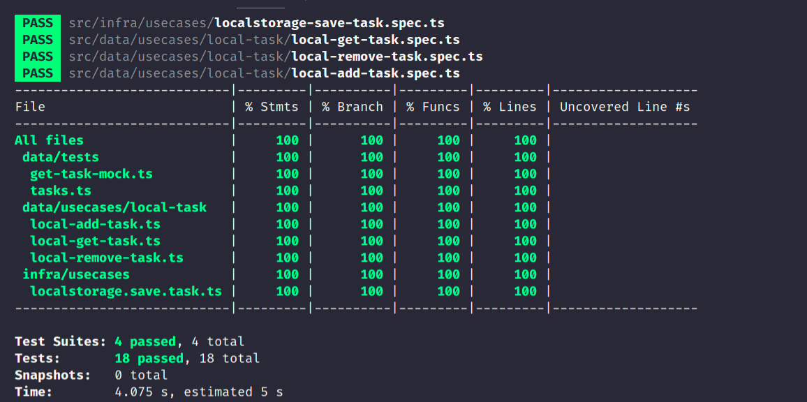

# Clean Task List

> This is a project of a Task list using concepts like:

* TDD
* Single Responsibility Principle (SRP)
* Open Closed Principle (OCP)
* Liskov Substitution Principle (LSP)
* Interface Segregation Principle (ISP)
* Dependency Inversion Principle (DIP)
* You Aren't Gonna Need It (YAGNI)

> Some Design Patterns like:

* Dependency Injection
* Factory

> We have 100% test's coverage

I hope you enjoy it 😁 !

by: @pbpeterson